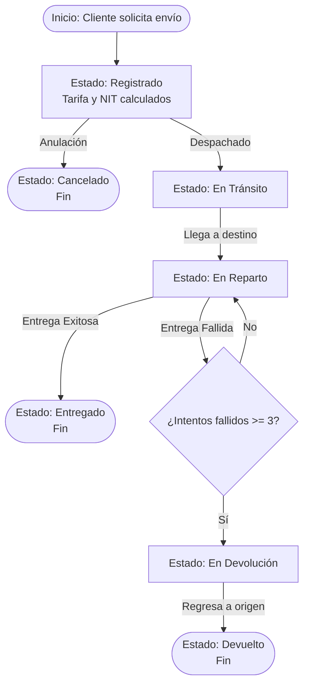

# 📦 Envíos Rápidos GT - API REST

**Proyecto:** Sistema de Gestión de Envíos  
**Asignatura:** Análisis de Sistemas I  
**Fecha:** 13/Jun/2026  
**Catedrático:** Ing. Marco Tulio Valdez  

API REST desarrollada en C# (.NET 8) con base de datos SQLite y Entity Framework Core. Este proyecto maneja la lógica de negocio para una empresa de logística, incluyendo cálculo de tarifas por peso, validación de NIT (módulo 11) para descuentos, y un control de estados inmutables con límite de intentos de entrega.

---

## ☁️ Despliegue en la Nube (Render)

La API se encuentra desplegada y funcionando en vivo a través de Render utilizando un contenedor Docker. 

**URL Base de Producción:**
👉 `https://zero907-23-13365analisisa2026final.onrender.com`

**¿Cómo probarlo?**
Puedes utilizar herramientas como **Postman**, **Thunder Client** o comandos de terminal, apuntando a los endpoints descritos abajo. 

*Ejemplo de prueba rápida en PowerShell:*
```powershell
Invoke-RestMethod -Uri "[https://zero907-23-13365analisisa2026final.onrender.com/api/clientes](https://zero907-23-13365analisisa2026final.onrender.com/api/clientes)" -Method Get
```

*(Nota: Al estar en la capa gratuita de Render, si la API pasa inactiva por 15 minutos, entrará en suspensión. La primera petición para despertarla puede tardar unos 50 segundos, y la base de datos de SQLite en memoria se reiniciará en blanco).*

---

## 🔄 Diagrama de Flujo del Proceso

A continuación se detalla el ciclo de vida de un paquete y la lógica de transición de estados implementada en la API:



---

## 🚀 Instalación y Ejecución Local

Si deseas correr el proyecto en tu máquina local:

1. **Clonar el repositorio:**
   ```bash
   git clone [https://github.com/DerekMarmol/0907_23_13365ANALISISA2026FINAL.git](https://github.com/DerekMarmol/0907_23_13365ANALISISA2026FINAL.git)
   cd 0907_23_13365ANALISISA2026FINAL
   ```

2. **Restaurar dependencias y ejecutar:**
   ```bash
   dotnet restore
   dotnet run
   ```
   *La base de datos `envios.db` de SQLite se generará automáticamente.*
   *La API local responderá en el puerto configurado (ej. http://localhost:5237).*

---

## 🧪 Pruebas Unitarias (xUnit)

El proyecto cuenta con una suite de pruebas unitarias que validan las reglas de negocio críticas (Cálculo de tarifas, límite de intentos, validación de estados y validación de NIT).

Para ejecutar las pruebas:
```bash
# Asegúrate de detener la API (Ctrl+C) si está corriendo antes de ejecutar los tests
cd EnviosRapidosGT.Tests
dotnet test
```

---

## 📡 Endpoints Principales

| Método | Ruta | Descripción (Historia de Usuario) |
|---|---|---|
| **POST** | `/api/clientes` | Registra un nuevo cliente (HU-09). |
| **GET** | `/api/clientes/{id}` | Obtiene un cliente y su historial de envíos. |
| **POST** | `/api/envios` | Registra un envío, calcula tarifa y descuento (HU-01, HU-05). |
| **GET** | `/api/envios/{codigo}` | Consulta el estado y detalle por código de rastreo (HU-02). |
| **GET** | `/api/envios` | Listado general con soporte para filtros y paginación (HU-07). |
| **PUT** | `/api/envios/{codigo}/estado` | Actualiza el estado respetando el flujo permitido (HU-03, HU-06). |
| **POST** | `/api/envios/{codigo}/intento-fallido` | Registra un intento fallido. Al 3ro pasa a `EnDevolucion` (HU-04). |
| **POST** | `/api/envios/{codigo}/cancelar` | Cancela el envío solo si está en estado `Registrado` (HU-10). |
| **GET** | `/api/envios/reporte/devoluciones` | Genera reporte estadístico de devoluciones e intentos (HU-08). |

---

## 📁 Entregables del Examen Final

- [x] Mínimo 10 Historias de Usuario (`historias_de_usuario.md`).
- [x] Prototipo API REST en C# + Modelo de Datos.
- [x] Pruebas Unitarias usando xUnit (100% aprobadas).
- [x] Despliegue en Render (Docker).
- [x] Informe de Uso de IA (`informe_ia.md`).
- [x] Diagrama de Flujo (incluido en este archivo y trazado a mano).